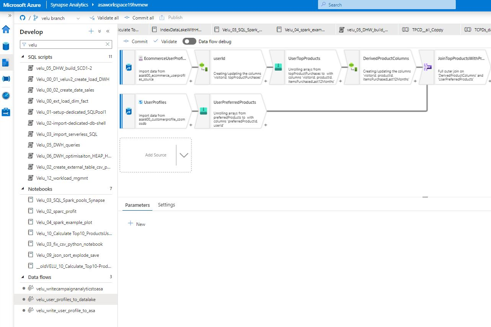
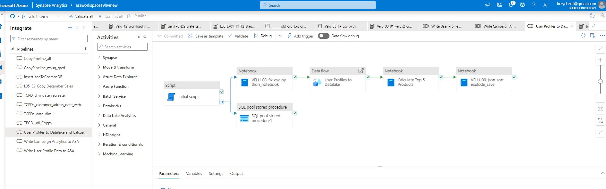

# Velu synapse demo
The purpose this repo is demonstrated DWH build in MS Synapse Analytics with variouse data transformation technics presentation
## Architecture
TODO (require preparation)
## Sample data to build DWH
### TPCD-DS
Sample generative data warehouse 
### Worldwide
### Sample database
[SQL create and load DWH](files/Velu_00_01_veluv2_create_load_DWH.sql)
## Data load to 'ext' layer
- create (silver/ext/staging) layer database structure
[create sample DWH structure](files/Velu_00_02_create_date_sales.sql)
[import data to serverless ext layer](files/Velu_03_import_serverless_SQL.sql)
[import files from csv files with manual shell execution](files/Velu_02-import-dedicated-db-shell.sql)

[create sample v2 DWH structure](files/Velu_00_ext_load_dim_fact.sql)
- slowly change dimension 1,2
[DWH load - Slowly change dimension 1,2](files/velu_05_DHW_build_SCD1-2.sql)
- repair input files
[fix broken input csv file](files/Velu_03_fix_csv_python_notebook.py)
[fix broken csv](files/VELU_03_fix_csv_python_notebook.html)

- read diffrent files
* [Process json file and save results ](files/VELU_09_json_sort_explode_save.html) [notebook](files/VELU_09_json_sort_explode_save.ipynb)
* [input json file processing (explode)](files/Velu_09_json_sort_explode_save (2).html)

- save files after transformation
## Data transformation 
- [process data and store to external files/gen2](files/Velu_02_create_external_table_csv_parquet.sql)
- [DWH calculation, data generation/preparation](files/Velu_10_Calculate Top10_ProductsUsers.py)
- [WDH queries TODO](files/Velu_05_DWH_queries.sql)

- [calculation example - calculate profit](files/Velu_02_sparc_profit (1).html)
- [pools](files/Velu_03_SQL_Spark_pools_Synapse.html)
- [pools python](files/Velu_03_SQL_Spark_pools_Synapse.py)

## Data optimisation
- Indexes, Cache views
[DWH optimisation result](files/Velu_06_DWH_optimisaiton.sqlplan)
[WDH optimisation Heap->Hash, partitions, views](files/Velu_06_DWH_optimisaiton_HEAP_HASH_Partition.sql)

- Tuning platform
[tuning process to create dedicated SQL pools for specific users or process (files/Velu_01-setup-dedicated_SQLPool1.sql)
[Synapse confirm like worload management](files/Velu_12_workload_mgmnt (1).sql)
## Piplines examples

## Other analitics pipelines
[example analytic notebook python code](files/Velu_04_spark_example_plot.py)
[example analytic notebook](files/Velu_04_spark_example_plot (1).html)

